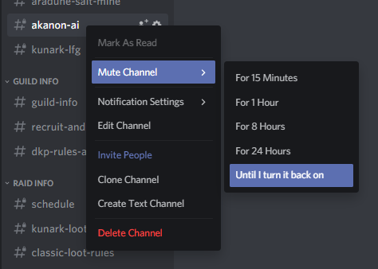

# Ak'Zam - !zam !bis
***Ak'Zam*** will lookup specific items, and help you search for best in slot gear. These bot commands link to everquest.allakhazam.com which has a lot of advertisements. If you want to avoid Ad's we recommend you install [AdBlock](https://getadblock.com/).

## Item Search
```
!zam <search string>
```

Example:
```
!zam Dagas
```


## Lookup `Best In Slot (BIS)` items for your class 
```
!bis <race> <class> <slot> [expansion] (Default expansion: The Ruins of Kunark)
```

Example:
```
!bis ogre warrior chest
```

```
!bis ogre warrior primary velious
```

# Muting the bot channel
Since the bot command channel can tend to be a bit spammy, you may want to `mute` it. You can do so by `right clicking` on the channel, navigating to `Mute Channel` and deciding how long you want to mute it for.

